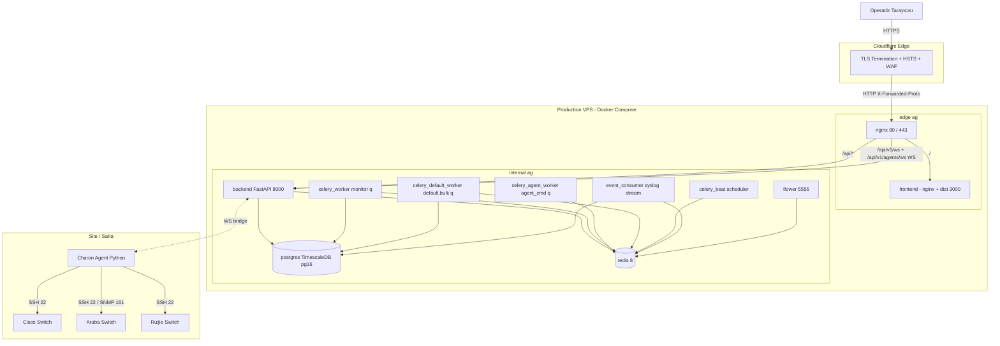
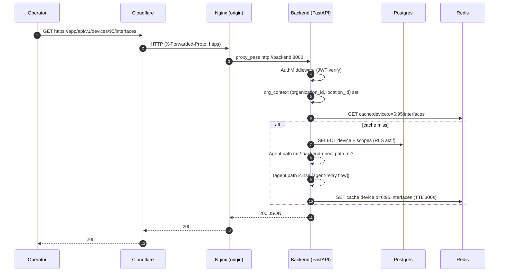
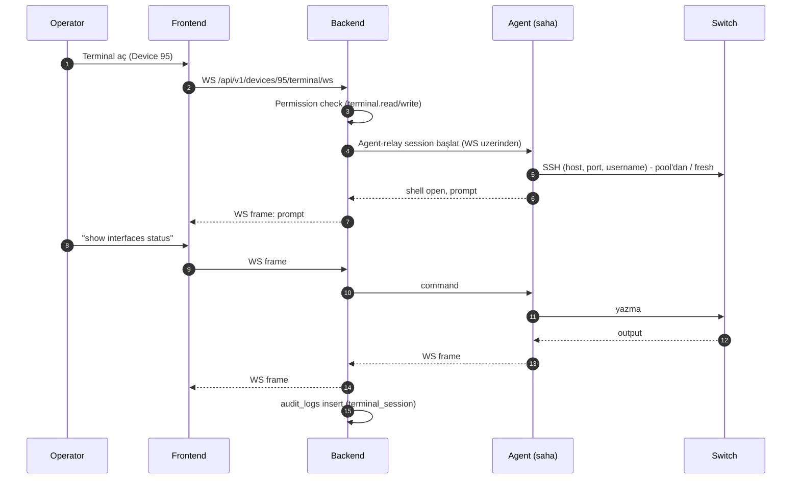
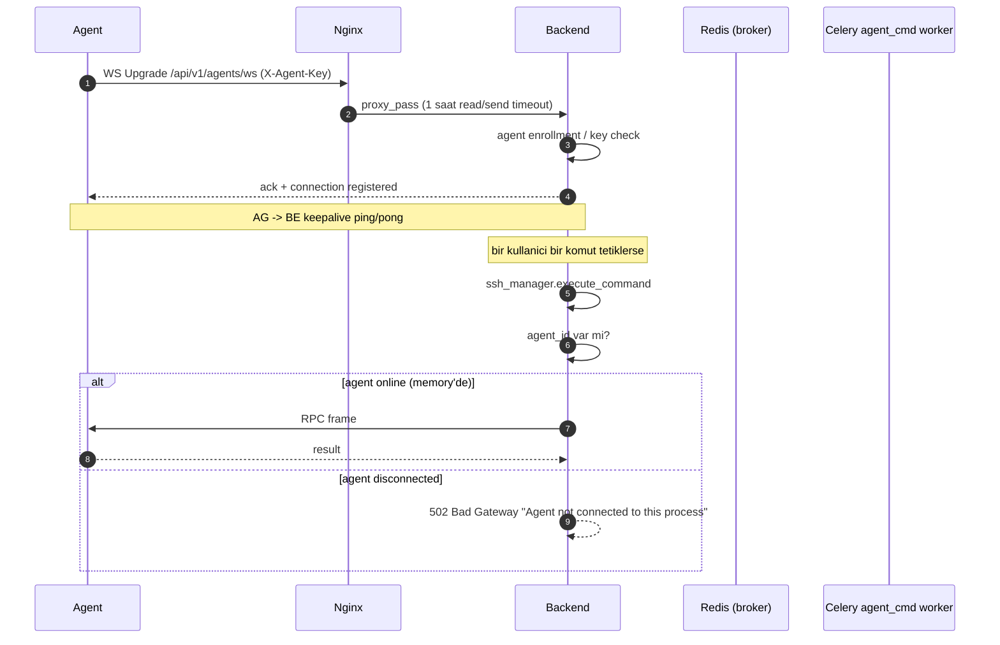
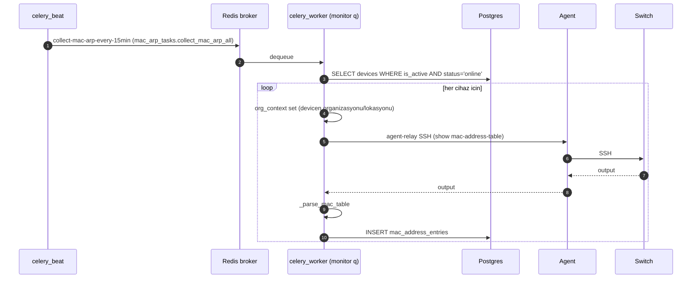
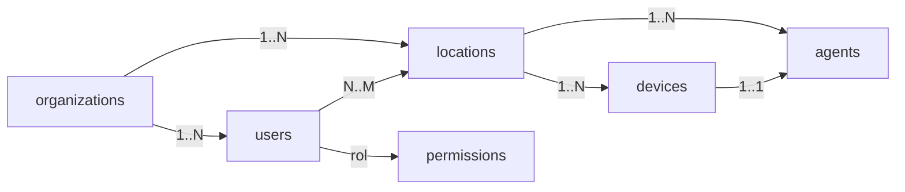

# 01 — Mimari Genel Bakış

## 1. Yüksek seviye topoloji

**Önemli kontratlar:**

| Bileşen | Network üyeliği | Dışarıdan erişilebilir mi? |
|---|---|---|
| `nginx` | `edge` + `internal` | Evet — tek dış kapı (80) |
| `frontend` | `edge` | Hayır (yalnız nginx üzerinden) |
| `backend` | `internal` | Hayır (yalnız nginx üzerinden) |
| `postgres`, `redis` | `internal` | Hayır — host'a publish edilmez |
| Celery worker'lar / beat / event_consumer / flower | `internal` | Hayır |

Kaynak: [docker-compose.yml](../../docker-compose.yml) `T10 B1c — network segmentation` bloğu.

> Cloudflare tunnel veya origin certificate kullanımı: ⚠ **VERIFY BEFORE HANDOVER** — paketin hazırlandığı oturumda doğrulanmamıştır.

## 2. Frontend, backend, PostgreSQL, Redis, Celery, Flower, Nginx, Cloudflare, agent ve cihaz ilişkisi

### Frontend
- **Vite + React + React Query 5 + Zustand** stack.
- Build sonucu `dist/` Nginx ile servis edilir (`frontend/Dockerfile` production stage).
- Auth token Zustand `persist` middleware ile `localStorage` üstünde tutulur.
- API çağrıları React Query üstünden yapılır; cache key + queryKey ile per-tenant ayrılır (`SiteContext` queryKey: `['context', 'current', sessionEpoch, routeOrgId, activeLocationId]`).

### Backend
- **FastAPI** + **SQLAlchemy** (`asyncpg` ve sync `psycopg2` her ikisi de kullanılır; bkz. compose env).
- WebSocket endpoints: `/api/v1/ws` (operatör event stream), `/api/v1/agents/ws` (agent ↔ backend bridge).
- Endpoint katmanları `backend/app/api/v1/endpoints/` altında modüler.

### PostgreSQL
- TimescaleDB latest pg16 image; `max_connections=200`, `shared_buffers=512MB` (compose).
- İki rol: `POSTGRES_USER` (superuser; **yalnız Alembic** kullanır — `MIGRATION_DATABASE_URL`) ve `APP_DB_USER` (uygulama; RLS aktif).
- Snapshot tabloları (mac/arp/poe/vlan) Timescale hypertable olabilir — ⚠ **VERIFY BEFORE HANDOVER** (`backend/alembic/versions/` içinde hypertable seçenekleri var; production'da hangileri açık doğrulanmalı).

### Redis
- Celery broker + result backend (`REDIS_URL=redis://redis:6379/0`).
- Cache: device interfaces (`_IFACE_CACHE_TTL=300`), VLAN, aggregation cache, terminal session metadata.
- `event_consumer:alive` TTL=30s heartbeat key.
- Syslog ingestion stream: `ingest:syslog`.

### Celery
- **3 worker havuzu, ayrı queue** (Faz 6A):
  - `monitor` queue → `celery_worker` (concurrency=16) → SNMP, topology, playbooks, analytics, mac_arp
  - `agent_cmd` queue → `celery_agent_worker` (concurrency=8) → synthetic probes, agent peer latency
  - `default,bulk` queue → `celery_default_worker` (concurrency=8) → correlation, backup, bulk SSH/config
- `celery_beat`: 32 zamanlanmış görev (`celery_app.py beat_schedule`).
- Flower: `5555` üzerinde basic_auth; production'da host'a publish edilmez, yalnız `docker-compose.dev.yml` overlay'i ile dev erişimi.

### event_consumer
- Bağımsız Python servisi (`python -m app.services.event_consumer`); Redis stream `ingest:syslog`'u drain eder.

### Nginx
- `frontend/nginx.conf` (frontend container içi) + `nginx/nginx.conf` (edge proxy).
- Edge nginx: TLS termination CF tarafında olabilir; nginx HSTS + X-Frame + Referrer-Policy + Permissions-Policy ekler.
- Vite dev path'leri (`/@vite`, `/src/`, `/node_modules/`, `/__open-in-editor`) production'da 404 (pentest gereği).
- HTTP → HTTPS redirect, `X-Forwarded-Proto = http` ise 308.

### Cloudflare
- Edge'de TLS terminate, HSTS edge'de zorlanır.
- ⚠ **VERIFY BEFORE HANDOVER**: Tunnel adı, panel hesabı sahipliği, DNS, WAF kuralları, page rules.

### Charon Agent
- Saha tarafı **Python servisi** (`backend/agent_script/netmanager_agent.py`).
- Backend'e **WebSocket** ile bağlanır; backend'den gelen SSH/SNMP komutlarını ilgili cihaza iletir.
- Agent ↔ cihaz SSH bağlantıları **`(host, port, username)` keyli pool** üstünde `_POOL_TTL=300s` TTL'li tutulur. Bu pool'un detayı [03](03-BACKEND-FRONTEND-AGENT-ARCHITECTURE.md) ve [06](06-AGENT-INSTALLATION-AND-OPERATIONS.md) dosyalarında.

## 3. Request flow — bir REST çağrısı

## 4. Device command flow — bir terminal komutu

## 5. Agent WebSocket / relay flow

## 6. Background collection flow

Benzer akış: `snmp_tasks.poll_snmp_all` (5 dk), `poe_tasks.snapshot_poe_status` (15 dk), `topology_tasks.scheduled_topology_discovery` (6 saat), `bulk_tasks.scheduled_backup` (24 saat), `behavior_analytics_tasks.detect_anomalies` (30 dk), vb.

Tam beat schedule listesi: [07-CELERY-REDIS-BACKGROUND-JOBS.md](07-CELERY-REDIS-BACKGROUND-JOBS.md) §Periyodik task'lar.

## 7. Tenant / organization / location ilişkisi

- **organizations**: tenant boundary. Postgres RLS bu kolon (`organization_id`) üstünden uygulanır.
- **locations**: bir organizasyonun saha bölümleri (bina, kat, oda); cihaz ve agent atamasının birimi.
- **devices**: bir lokasyona aittir; opsiyonel olarak bir `agent_id` taşıyabilir (private network erişim için).
- **users**: bir organizasyona aittir; rol + lokasyon ataması ile yetkilendirilir.
- **org-wide kullanıcı**: `is_org_wide=True` flag'li kullanıcı tüm lokasyonlara erişir (`org_admin` örneği).

Detay: [05-SECURITY-RBAC-ORGANIZATION-SCOPING.md](05-SECURITY-RBAC-ORGANIZATION-SCOPING.md).

## 8. Doğrulanmış ve doğrulama bekleyen alanlar

### Doğrulanmış
- 11 compose servisi + ağ üyeliği (`docker-compose.yml`)
- Nginx WS / REST / health proxy bloğu (`nginx/nginx.conf`)
- Celery 3 queue + 33 beat schedule (`backend/app/workers/celery_app.py`)
- Frontend production target ve dev path 404 koruması
- Agent script pool key (host, port, username) ve TTL 300s

### VERIFY BEFORE HANDOVER
- Cloudflare tunnel mı yoksa A-record + origin cert mı? Edge WAF kuralları?
- Production'da etkin Timescale hypertable seti
- Monitoring overlay (Prometheus/Grafana) production'da çalışıyor mu, yoksa dev-only mu
