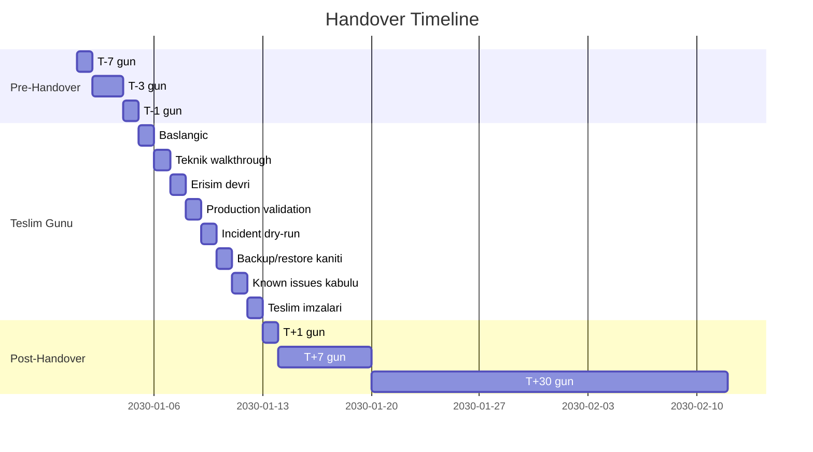

# 19 — Handover Day Runbook

> **Amaç:** Teslim gününü iki ekibin de net bilgisi ile yürütmek için aşama bazlı zaman çizelgesi. Her satır şu sözleşmeyi taşır: **Amaç / Sorumlu / Girdi / Yapılacak iş / Başarı kriteri / Çıkış kanıtı / Escalation**.

> **Genel kural (her aşamada):**
> 
> ```
> Gerçek credential değerleri bu dokümanlara yazılmaz.
> Credential paylaşımı yalnız onaylı parola kasası, güvenli erişim
> yöneticisi veya kontrollü break-glass süreci üzerinden yapılır.
> ```

## Zaman çizelgesi



> Yukarıdaki şema **göreli** sürelerle çizilmiştir; sahaya göre tarihler değişir.

---

## T-7 gün — Hazırlık

**Amaç:** Devir alan ekibin paketle tanışması, eksik erişimlerin keşfedilmesi.  
**Sorumlu:** Devir veren proje sahibi  
**Girdi:** Bu repo, [HANDOVER_INDEX.md](../../HANDOVER_INDEX.md), [README](README.md), [00 Executive](00-EXECUTIVE-HANDOVER.md)  
**Yapılacak iş:**
- Repository read access devir alan ekibe açılır
- 00-EXECUTIVE-HANDOVER + 01 + 02 dosyaları okunur
- [14-SECRETS-ACCESS-HANDOVER-TEMPLATE.md](14-SECRETS-ACCESS-HANDOVER-TEMPLATE.md) ve [17-ACCESS-AND-OWNERSHIP-MATRIX.md](17-ACCESS-AND-OWNERSHIP-MATRIX.md) iskeletleri devir alan ekiple paylaşılır
- Devir alan ekip kendi SSH public key'lerini hazırlar
- [16-LIVE-ENVIRONMENT-COMPLETION-WORKSHEET.md](16-LIVE-ENVIRONMENT-COMPLETION-WORKSHEET.md) ilk geçiş (boş kutular doldurulmaya başlar)

**Başarı kriteri:**
- Devir alan ekip Charon/NetManager'ın **mimari ve modüler kapsamını** kafasında oturtmuş
- Soru listesi hazır (T-3 oturumunda ele alınacak)

**Çıkış kanıtı:**
- Devir alan ekip onayı (e-posta / Slack mesajı): "okudum, sorularım var"

**Escalation:** Devir alan ekip pakete erişemiyorsa repo admin (Primary Owner) ile devamı sağlanır.

---

## T-3 gün — Walkthrough oturumu

**Amaç:** Devir alan ekibin sorularını canlı olarak yanıtlamak.  
**Sorumlu:** Devir veren teknik sahibi + devir alan teknik sahibi  
**Girdi:** T-7 gün soru listesi, dokümantasyon paketi  
**Yapılacak iş:**
- 60-90 dk online oturum
- Mimari + deploy + incident runbook gözden geçirilir
- [12-KNOWN-ISSUES-TECH-DEBT-ROADMAP.md](12-KNOWN-ISSUES-TECH-DEBT-ROADMAP.md) TD-1..TD-20 satır satır anlatılır
- [16-LIVE-ENVIRONMENT-COMPLETION-WORKSHEET.md](16-LIVE-ENVIRONMENT-COMPLETION-WORKSHEET.md) eksik kalan alanlar planlanır

**Başarı kriteri:**
- Soru listesinin **tamamı** yanıtlandı (yanıtlanamayanlar açıkça "post-handover backlog" olarak işaretlendi)
- Devir alan ekip kendi rolünü ([17-ACCESS-AND-OWNERSHIP-MATRIX.md](17-ACCESS-AND-OWNERSHIP-MATRIX.md)) tanımladı

**Çıkış kanıtı:**
- Oturum notları (kim ne sordu, ne cevap aldı)
- Güncellenmiş [17-ACCESS-AND-OWNERSHIP-MATRIX.md](17-ACCESS-AND-OWNERSHIP-MATRIX.md) draft

**Escalation:** Cevaplanamayan kritik sorular varsa T-1'e taşınır.

---

## T-1 gün — Son hazırlık

**Amaç:** Erişim transferine "go" verilebilir hale gelmek.  
**Sorumlu:** Her iki ekip  
**Girdi:** [17 §10 erişim devri tamamlandı kontrolü](17-ACCESS-AND-OWNERSHIP-MATRIX.md) checklisti  
**Yapılacak iş:**
- Devir veren ekip kasaya hazır secret listesini son haline getirir
- Devir alan ekibin SSH key'leri henüz VPS'e **eklenmedi** (T-Day yapılacak — overlap penceresi)
- Cloudflare member daveti hazır (T-Day kabul)
- DB backup taze (son 24 saat) — [10 §4](10-MONITORING-BACKUP-RECOVERY-RUNBOOK.md)
- Restore tatbikat staging env hazır

**Başarı kriteri:**
- Tüm pre-conditions [16](16-LIVE-ENVIRONMENT-COMPLETION-WORKSHEET.md) §17 tablosuna girildi
- Bir sonraki gün için T-Day blok takvimi her iki ekipte de tutuldu

**Çıkış kanıtı:**
- T-1 son toplantı notu

**Escalation:** Backup taze değilse / restore tatbikat env hazır değilse T-Day **ertelenir**.

---

## T-Day Başlangıç — Kick-off (~30 dk)

**Amaç:** Teslim gününün yapısını netleştirmek.  
**Sorumlu:** Her iki tarafın proje sahipleri  
**Girdi:** T-1 notları  
**Yapılacak iş:**
- Tüm tarafların hazır olduğunun doğrulanması
- Gün boyu kullanılacak iletişim kanalı + döküm yeri tanımlanır
- Bu doküman (§T-Day Başlangıç → §Teslim imzaları) sıralı olarak uygulanacak

**Başarı kriteri:**
- Roll-call: her sorumlu hazır
- Saatlik checkpoint planı

**Çıkış kanıtı:**
- Kick-off notu (zaman damgalı)

**Escalation:** Hiçbir kritik kişi yoksa o gün ertelenir.

---

## T-Day — Teknik walkthrough (~60 dk)

**Amaç:** Devir alan ekibe canlı production'ı **gözle göstermek**.  
**Sorumlu:** Devir veren teknik sahibi (paylaşımlı ekran)  
**Girdi:** VPS erişimi (devir veren tarafında)  
**Yapılacak iş:**
- `[READ ONLY]` `docker compose ps` — 11 servis healthy
- `[READ ONLY]` `docker compose logs --tail=50 backend` — temiz log
- UI'da login → dashboard → devices listesi
- Bir cihazda Terminal aç → privileged mode `#` gösterimi
- Audit Log son entry'leri gösterimi
- Flower (varsa dev overlay) — task aktivitesi
- Cloudflare panel'inde DNS + WAF kuralları (varsa)

**Başarı kriteri:**
- Devir alan ekip her ekranın **anlamını** kavradı
- Sorular yanıtlandı (kalanlar parking-lot)

**Çıkış kanıtı:**
- Walkthrough ekran kaydı veya zaman damgalı notlar

**Escalation:** Walkthrough sırasında **gözle görülür anomali** çıkarsa (servis unhealthy, error spam, vb.) gün durdurulur, [11-INCIDENT-TROUBLESHOOTING-RUNBOOK.md](11-INCIDENT-TROUBLESHOOTING-RUNBOOK.md) açılır.

---

## T-Day — Erişim devri (~60-90 dk)

**Amaç:** Devir alan ekibin gerçek erişim sahibi olması.  
**Sorumlu:** Devir veren proje sahibi + devir alan teknik sahibi  
**Girdi:** [17-ACCESS-AND-OWNERSHIP-MATRIX.md](17-ACCESS-AND-OWNERSHIP-MATRIX.md) iskeletindeki tüm satırlar  
**Yapılacak iş:**
- GitHub repo admin daveti gönderilir → devir alan ekip kabul eder
- Branch protection ayar sahipliği transfer edilir
- VPS'e devir alan ekibin SSH public key'i eklenir
- Devir alan ekip kendi makinesinden SSH dener — **başarılı** olmalı
- Cloudflare member daveti gönderilir → kabul
- Domain registrar member / sahiplik transferi başlatılır
- Production `.env` vault yetkisi devir alan ekibe verilir (vault üzerinden, **değer kopyalamadan**)
- Her agent host'a devir alan ekibin SSH key'i eklenir
- Monitoring panel + alert channel'a devir alan ekip eklenir

**Başarı kriteri:**
- [17 §10 erişim devri tamamlandı kontrolü](17-ACCESS-AND-OWNERSHIP-MATRIX.md) **tamamı işaretli**
- Her erişim devir alan ekip tarafından **fiilen test edildi**
- Devir veren ekibin gereksiz erişimleri için **revoke takvimi** belirlendi (overlap penceresi, örnek: 30 gün)

**Çıkış kanıtı:**
- Güncel [17-ACCESS-AND-OWNERSHIP-MATRIX.md](17-ACCESS-AND-OWNERSHIP-MATRIX.md) (Primary + Backup Owner sütunları dolu)
- Her satır için "Son Doğrulama" tarihi bugün

**Escalation:** Bir erişim devredilemiyor (kanal kapalı, panel hesabı bulunamıyor) ise [16 §17](16-LIVE-ENVIRONMENT-COMPLETION-WORKSHEET.md) "PENDING" olarak işaretlenir + post-handover backlog'a düşer.

---

## T-Day — Production validation (~60-90 dk)

**Amaç:** [18-PRODUCTION-VALIDATION-EVIDENCE-TEMPLATE.md](18-PRODUCTION-VALIDATION-EVIDENCE-TEMPLATE.md) §1-§14'ün **tamamı PASS** olarak kapatılmak.  
**Sorumlu:** Devir alan teknik sahibi (uygular) + devir veren teknik sahibi (gözlemler)  
**Girdi:** Devir alan ekibin VPS SSH erişimi şimdi aktif  
**Yapılacak iş:**
- [18 §1](18-PRODUCTION-VALIDATION-EVIDENCE-TEMPLATE.md) git revision doğrulama → PASS
- [18 §2-§14](18-PRODUCTION-VALIDATION-EVIDENCE-TEMPLATE.md) her bölüm sırasıyla doldurulur, kanıt eklenir
- Yalnız READ ONLY komutlar
- Sonuç sütununa PASS/FAIL girer; FAIL varsa hemen [11](11-INCIDENT-TROUBLESHOOTING-RUNBOOK.md) açılır

**Başarı kriteri:**
- [18 §1-§14](18-PRODUCTION-VALIDATION-EVIDENCE-TEMPLATE.md) tamamı PASS
- Her satır için kanıt linki / ek mevcut

**Çıkış kanıtı:**
- Doldurulmuş [18-PRODUCTION-VALIDATION-EVIDENCE-TEMPLATE.md](18-PRODUCTION-VALIDATION-EVIDENCE-TEMPLATE.md)

**Escalation:** Bir kontrol FAIL ise o blok için ayrı incident kaydı + bu adım durur. [16 §17](16-LIVE-ENVIRONMENT-COMPLETION-WORKSHEET.md) PENDING / RISK ACCEPTED durumu belirlenir.

---

## T-Day — Incident dry-run (~30-45 dk)

**Amaç:** Devir alan on-call'un panik yaşamadan ilk incident'a uygulamayı bilebilmesi.  
**Sorumlu:** Devir alan on-call + devir veren teknik sahibi (gözlemci)  
**Girdi:** [11-INCIDENT-TROUBLESHOOTING-RUNBOOK.md](11-INCIDENT-TROUBLESHOOTING-RUNBOOK.md) — bir senaryo seçilir (örnek: Senaryo 8 "Ports tab No ports found")  
**Yapılacak iş:**
- Devir alan on-call senaryo metnini okur
- READ ONLY doğrulamaları canlı production'da (varolan bir test cihazında) uygular
- "Yasak müdahaleler" listesini saydırır
- "Güvenli sonraki adım" alanını açıkça **uygulamadan** sözlü tarif eder
- Escalation kriterini söyler

**Başarı kriteri:**
- Devir alan on-call senaryoyu uçtan uca anlamış
- "Şimdi ne yapardım" cevabı **yasak müdahaleler listesini** ihlal etmiyor

**Çıkış kanıtı:**
- Dry-run notu (hangi senaryo, kim uyguladı, eksikler)

**Escalation:** Devir alan ekip kritik bir yasak müdahaleyi sözel olarak "yapmak" derse anında durdurulur, eğitim eklenir.

---

## T-Day — Backup / restore kanıtı (~30-45 dk)

**Amaç:** "Eğer her şey gitse geri getirebilir miyiz?" sorusuna **somut PASS** vermek.  
**Sorumlu:** Devir alan SRE + devir veren teknik sahibi  
**Girdi:** [16 §8 backup satırları](16-LIVE-ENVIRONMENT-COMPLETION-WORKSHEET.md), staging env  
**Yapılacak iş:**
- Production backup'tan en taze `.pgdump` alınır (kasaya dokunulmaz, dosya kopyası alınır)
- **Staging** env'da `pg_restore --clean` uygulanır
- Restore sonrası staging'de login + dashboard smoke
- Restore süresi ölçülür
- Bir test kullanıcısı oluşturulup audit log'da entry görünür

**Başarı kriteri:**
- Restore başarılı + smoke PASS
- RTO ölçümü kayda alındı
- [18 §12](18-PRODUCTION-VALIDATION-EVIDENCE-TEMPLATE.md) PASS

**Çıkış kanıtı:**
- Restore log + smoke ekran görüntüsü (secret içermez)
- Ölçülen RTO

**Escalation:** Restore başarısızsa **handover acceptance bloklanır** ([15 §K](15-ACCEPTANCE-AND-HANDOVER-CHECKLIST.md) ek kural).

---

## T-Day — Known issues kabulü (~30 dk)

**Amaç:** TD-1..TD-20 her satır için devir alan ekibin **bilinçli kabul** etmesi.  
**Sorumlu:** Devir alan ekip lideri  
**Girdi:** [12-KNOWN-ISSUES-TECH-DEBT-ROADMAP.md](12-KNOWN-ISSUES-TECH-DEBT-ROADMAP.md), [18 §18](18-PRODUCTION-VALIDATION-EVIDENCE-TEMPLATE.md) tablosu  
**Yapılacak iş:**
- TD-1'den TD-20'ye kadar her satır okunur
- Devir alan ekip lideri "anladım, sahipleneceğim" notunu [18 §18](18-PRODUCTION-VALIDATION-EVIDENCE-TEMPLATE.md) tablosuna girer
- Hangileri ilk ay sprint'e gireceği seçilir
- Tahmini effort + sahibi belirlenir

**Başarı kriteri:**
- [15 §K](15-ACCEPTANCE-AND-HANDOVER-CHECKLIST.md) "Bilinen risklerin kabulü" satırlarının **tamamı** imzalı
- İlk ay sprint planı taslağı

**Çıkış kanıtı:**
- Doldurulmuş [18 §18](18-PRODUCTION-VALIDATION-EVIDENCE-TEMPLATE.md) tablosu

**Escalation:** Bir TD maddesi için devir alan ekip "kabul etmiyorum, çözülmeden devralmam" derse handover **bloklanır**.

---

## T-Day — Teslim imzaları (~30 dk)

**Amaç:** Resmi devir.  
**Sorumlu:** Her iki tarafın proje sahibi + teknik sahibi  
**Girdi:** Tüm önceki aşamaların çıktıları + [15-ACCEPTANCE-AND-HANDOVER-CHECKLIST.md](15-ACCEPTANCE-AND-HANDOVER-CHECKLIST.md)  
**Yapılacak iş:**
- [15 §A-§K](15-ACCEPTANCE-AND-HANDOVER-CHECKLIST.md) her bölüm gözden geçirilir
- Eksik kalan satırlar [15 §L](15-ACCEPTANCE-AND-HANDOVER-CHECKLIST.md) "Eksik erişimlerin listesi"ne girer
- [15 §M](15-ACCEPTANCE-AND-HANDOVER-CHECKLIST.md) "Final imzalar" tablosu **canlı imzalanır** (e-imza, PDF, GPG-signed mesaj, vb.)
- Handover tarihi kayıt altına alınır

**Başarı kriteri:**
- [15 §M](15-ACCEPTANCE-AND-HANDOVER-CHECKLIST.md) imzaları **dört taraf da tamamladı**

**Çıkış kanıtı:**
- İmzalı [15-ACCEPTANCE-AND-HANDOVER-CHECKLIST.md](15-ACCEPTANCE-AND-HANDOVER-CHECKLIST.md) çıktısı
- Resmi handover duyurusu (kuruma)

**Escalation:** İmza eksikse handover **resmi olarak tamamlanmamış** sayılır.

---

## T+1 gün — İlk gün sahiplik

**Amaç:** Devir alan ekibin gerçek operasyonu kavraması; herhangi bir "yarın bir şey patladı" anında nasıl davranılacağını ilk kez yaşaması.  
**Sorumlu:** Devir alan on-call  
**Girdi:** Tüm dokümantasyon paketi  
**Yapılacak iş:**
- [13 §1 günlük operasyon kontrolü](13-OPERATIONS-CHECKLISTS.md) çalıştırılır
- Bir önceki günün audit log'u taranır
- Bir gerçek (küçük) operasyon talebi varsa devir alan ekip yapar; devir veren ekip gözlemci

**Başarı kriteri:**
- Day 1 checklist tamamlandı
- Devir alan ekip sorun yaşamadan günü kapattı

**Çıkış kanıtı:**
- Day 1 günlük rapor (Slack mesajı / wiki entry)

**Escalation:** Devir veren ekip "shadow on-call" olarak ulaşılabilir kalır (önceden belirlenen kanal).

---

## T+7 gün — İlk hafta retrospektifi

**Amaç:** Kırık noktaları erken görmek.  
**Sorumlu:** Her iki ekibin teknik sahibi  
**Girdi:** Bir hafta süresince oluşan tüm günlük rapor, incident, soru  
**Yapılacak iş:**
- Devir alan ekip "neyi bilmiyorduk" listesi çıkarır
- Devir veren ekip eksikleri kapatır
- [16 §17](16-LIVE-ENVIRONMENT-COMPLETION-WORKSHEET.md) "PENDING" satırlar revize edilir
- Eğer hiç incident yaşanmadıysa: bilinçli bir küçük "operasyon tatbikatı" yapılır (örn. test cihaz onboard)

**Başarı kriteri:**
- "Bilmediğimiz" listesi boşaldı veya backlog'a düştü
- Confidence düzeyi devir alan ekipte yükseldi

**Çıkış kanıtı:**
- Hafta sonu retrospektif notu

**Escalation:** Sürekli aynı tip incident yaşanıyorsa root-cause incelemesi açılır.

---

## T+30 gün — Kalıcı sahiplik

**Amaç:** Devir veren ekibin overlap support'unu kapatmak; resmi sahipliğin tek tarafa geçmesi.  
**Sorumlu:** Her iki tarafın proje sahipleri  
**Girdi:** T+1..T+29 günlük rapor + incident geçmişi  
**Yapılacak iş:**
- Devir veren ekibin kalan erişimleri **revoke** edilir (GitHub member, VPS SSH key, Cloudflare member, vb.)
- [17 §10 erişim devri kontrolü](17-ACCESS-AND-OWNERSHIP-MATRIX.md) "revoke takvimi" satırları doğrulanır
- TD-20 ve diğer P1/P2 işleri sprint'e girer
- Devir alan ekip kendi başına ilk ayını kapattı; "geri dönüş yok" kararı verilir

**Başarı kriteri:**
- Devir veren ekibin erişimleri **revoke edildi**
- Yeni ekip 30 günü **bağımsız** olarak kapattı

**Çıkış kanıtı:**
- Revoke onayı ekran görüntüleri (secret içermez)
- 30. gün retrospektif notu

**Escalation:** Devir alan ekip 30 gün sonunda hala kritik bir kalemi devralamamışsa **post-mortem** + ek overlap penceresi konuşulur.

---

## Genel kuralın tekrarı

Bu dokümandaki **her aşamada**:

```
Gerçek credential değerleri bu dokümanlara yazılmaz.
Credential paylaşımı yalnız onaylı parola kasası, güvenli erişim
yöneticisi veya kontrollü break-glass süreci üzerinden yapılır.
```

Bu kural ihlal edildiğinde handover **acceptance bloklanır**.
